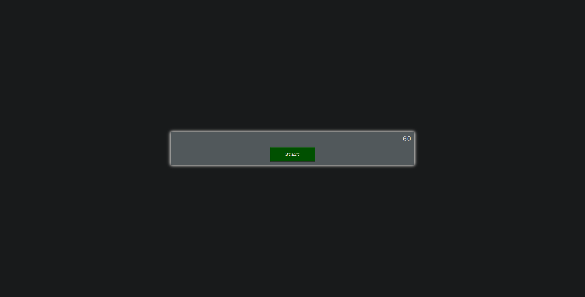

# code-quiz
# Code Quiz homework for UCF

# Maintained By:
Austin Donovan

# Description
This is a quiz game built in javascript / jQuery.

it utilizes click event listeners to determine which answer is correct. It then moves to the next question or deducts time based on which answer is clicked. it utilizes local time to log the game time to determine your score.

# Contact Information:
Email: AustinLDonovan@gmail.com

Github: https://github.com/AustinLD

# Project Location:
[Github Repository](https://github.com/AustinLD/code-quiz)

[Github Live Link](https://austinld.github.io/code-quiz/)

# Project Example:

